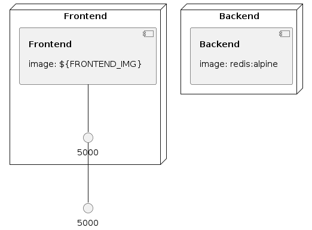

# Docker Amazon ECS/Fargate Example Application

In July of 2020, Docker and Amazon
[announced](https://www.docker.com/blog/from-docker-straight-to-aws/) a new
strategic partnership integrating Docker and Amazon ECS with Fargate.

You can watch a stream I did on the subject with the first demo
[here.](https://www.youtube.com/watch?v=RfQrgZFq_P0) The original demo app for
that video is [here.](https://github.com/docker/ecs-plugin/tree/master/example)

That original application is very simple to make it clear what is happening. The
commands are simple. We don't use any advanced Docker features. So what I wanted
to do with this repo is offer a more complete and realistic example. So here are
a couple things you'll find that are different:

- Multistage Dockerfile built with `buildkit`
- Local docker compose file with the Python code mounted as a volume. With Flask
  this allows live reload development.
- I added a secret to show how that would work.
- All the commands are context aware (default vs ecs)
- The `Makefile` to drive all this is more advanced.

So without any further ado, lets get into it.

## Python/Flask application

The Python application is still the same. On load it sends a timestamp to
`redis` and then renders a HTML page with all the timestamps in `redis`.

```
+--------------------+              +------------------+
|                    |              |                  |
|    Python Flask    |  timestamps  |      Redis       |
|    Application     |------------->|                  |
|                    |              |                  |
+--------------------+              +------------------+
```

Project structure:

```
.
├── docker-compose.dev.yaml
├── docker-compose.yaml
├── app
    ├── Dockerfile
    ├── requirements.txt
    └── app.py

```

### Compose File Overview

```
version: "3.8"
services:
  web:
    build:
      context: ./app
      target: prod
    environment:
      - FLASK_ENV=development
    volumes:
      - "${PWD}/app:/app"
    ports:
      - "5000:5000"
    depends_on:
      - backend
    secrets:
      - classified
  backend:
    image: redis:alpine

secrets:
  classified:
    file: secret.txt
```

Lets break that file down.

```
version: "3.8"
```

This sets a version for Docker Compose. `3.8` is the latest and you should
probably use it... at least for now because soon version will go away. This is
part of the work we are doing on the compose spec.

```
services:
  web:
    build:
      context: ./app
      target: prod
```

We're going to define the first service here and since we're using the `build`
keyword Compose knows its going to be on the hook for building an image vs
pulling an existing image.

`context` in this... context, tells Compose that the application and its
corresponding `Dockerfile` are in the `./app` directory. `target` is used to
specify which stage in a multistage build we want. [Read about the `Dockerfile`
a bit later in the README.](#multistage-dockerfile)

```
    environment:
      - FLASK_ENV=development
    volumes:
      - "${PWD}/app:/app"
```

These lines setup the Flask application to be able to do live reload. So if you
make a change to the `./app` in your editor while the container is running you
won't have to `docker-compose down`. Flask will detect the change and reload on
the fly. You can read more about how the `development` ENV works with Flask
[here](https://flask.palletsprojects.com/en/1.1.x/config/).

```
    ports:
      - "5000:5000"
    depends_on:
      - backend
    secrets:
      - classified
```

This gets more standard. Expose port 5000. Bring up the `backend` first. The new
bit for this version of the demo is adding support for the `secret`. You can
read all about the new secret stanza
[here](https://github.com/compose-spec/compose-spec/blob/master/spec.md#secrets-top-level-element).

```
  backend:
    image: redis:alpine
```

This is the same. We're just using `redis` it is super easy.

```
secrets:
  classified:
    file: secret.txt
```

This is the second half of the `secret`. In the `frontend` service we told
Compose that the service needs a `secret` named `classified` but we didn't
instantiate it. So we're going to use a file for the secret here. Compose will
do the right thing and create an AWS SecretManager with the contents of the
file. However, a better method then storing your secrets on disk would be to use
a different method to create the secret (the console, `docker secret create`,
etc) and passing the ARN to Compose an x parameter.

TODO: Add an example of using an external secret.

### Multistage `Dockerfile` Overview

If you look at the [`Dockerfile`](./app/Dockerfile) you'll see there are four
targets available: `base`, `src`, `test`, and `prod`.

#### Base

The `base` sets up all the dependencies. It installs the Python packages for
production and testing.

#### Source

`src` adds the source code. You could add this in `base`. Stages don't cost
anything so I kept it separate.

#### Test

`test` adds the test dependencies and runs the test. This is fairly clever as
you get the same behavior as building an image and then docker running the
result without needing to clean it up at the end.

#### Prod

`prod` This is the stage that you are going to want to run. Basically this
`Dockerfile` branches at testing. The unit tests don't need the application to
be running to test. The `prod` application doesn't need the testing
dependencies. So split them up and use the stage you need for the purpose you
have.

## Develop locally

```
make dev
```

Make all the changes you want in your IDE of choice. You can see the app running
on [http://localhost:5000](http://localhost:5000).

Once you have something you want to send to AWS its time to switch `context`.

## Code to Cloud

We use profiles at `$WORK` so what you see by when you create your AWS ECS
context is probably going to be different.

```
docker context create ecs ecs
? Select AWS Profile sandbox.devtools.developer
? Region us-west-2
? Enter credentials No
Successfully created ecs context "ecs"
```

Now you can switch `context` to set the default to `ecs`... and not `default`...
Naming is hard. 🤣

```
make build-image
make push-image-hub

or

make push-image-ecr

make deploy
```

Now sit back and sip on some lovely ☕.

What's happening? If you look at the `Makefile` what you just did was:

```
docker --context default build --target prod -t $(FRONTEND_IMG) ./app
```

Which means use my default context to build the `prod` stage of the Dockerfile
in the `./app` directory and tag it with the value in the `$(FRONTEND_IMG)`
variable.

Why is the `$(FRONTEND_IMG)` variable so complicated? Mostly because it works no
matter who checks out the code or where they check it out. I could have
hardcoded my values in here. But then you would have to edit the Makefile to
override them. In this case you can set a few environment variables and leave
the Makefile alone.

```
export REPO_NAMESPACE=<your Docker Hub username or the org you can push to>
export HUB_PULL_SECRET=<whatever your secret ARN is find it with docker secret ls>
export REGISTRY_ID=<whatever your ECR registry id is>
```

So the deploy is just `docker compose up` but the Makefile sets the variables so
they don't have to be hardcoded. This may or may not be useful at your `$WORK`.
It just depends on how your teams use clusters and registries. Hardcode all you
want if it makes sense.

Thats it. You are now running in AWS ECS.

```
docker compose ps
```

You can see whats running and if your application exposes a port you can get the
loadbalancer name and port here.

```
docker compose logs
```

Watch those timestamp requests scroll on by.

```
docker compose down
```

This stuff costs real money to deploy so when you are done clean it up.


### Infrastructure model

